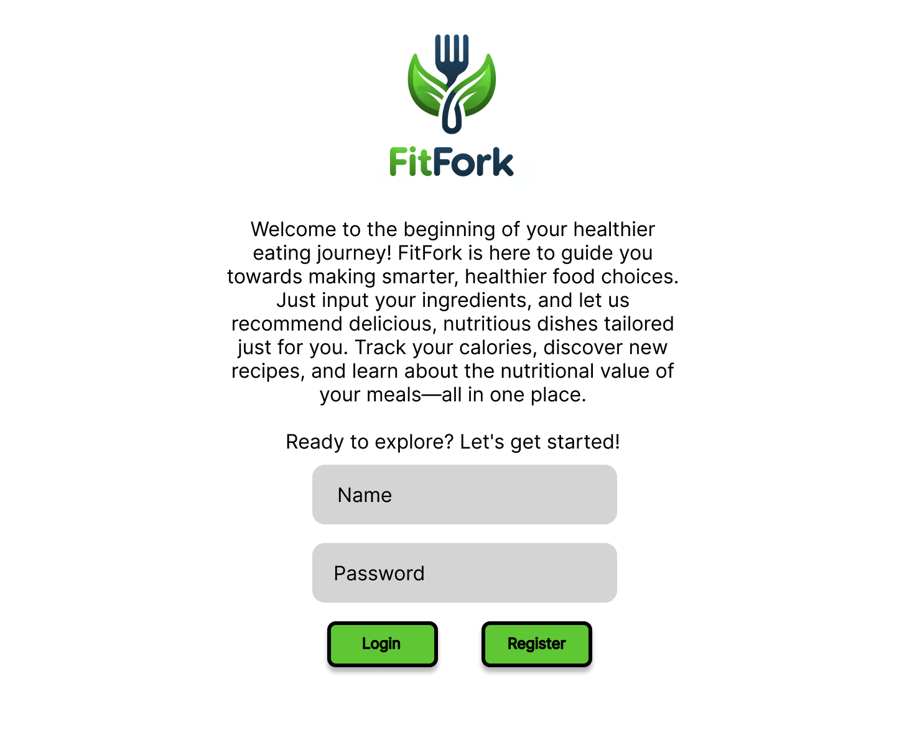
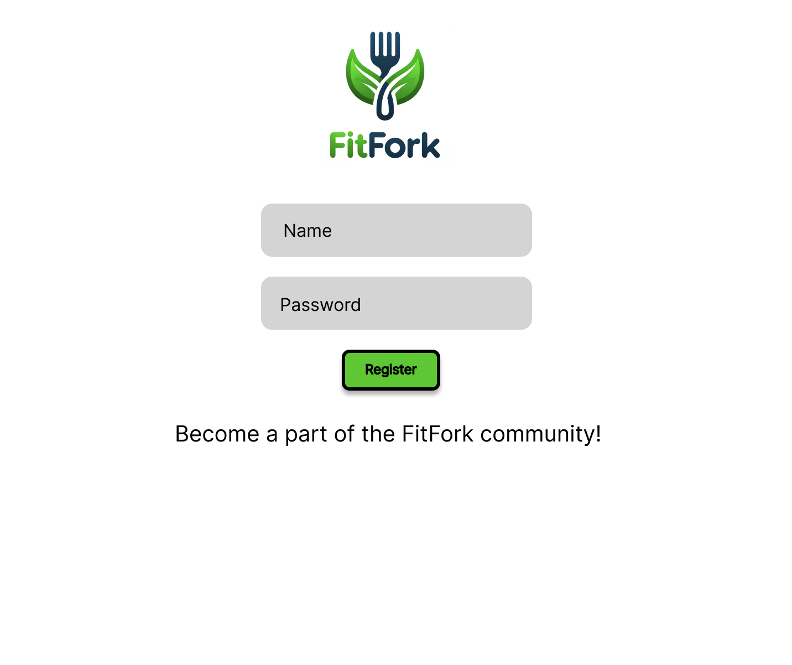
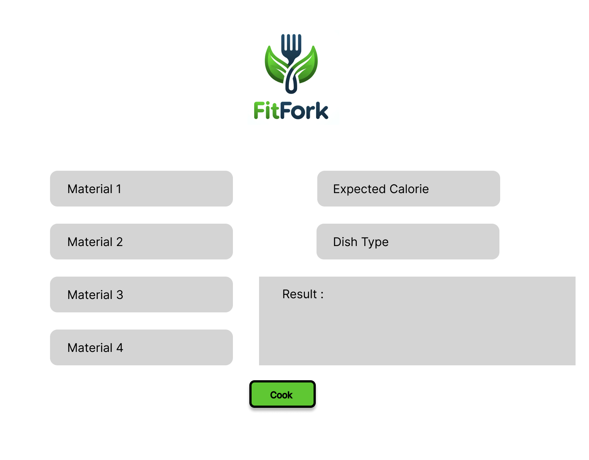
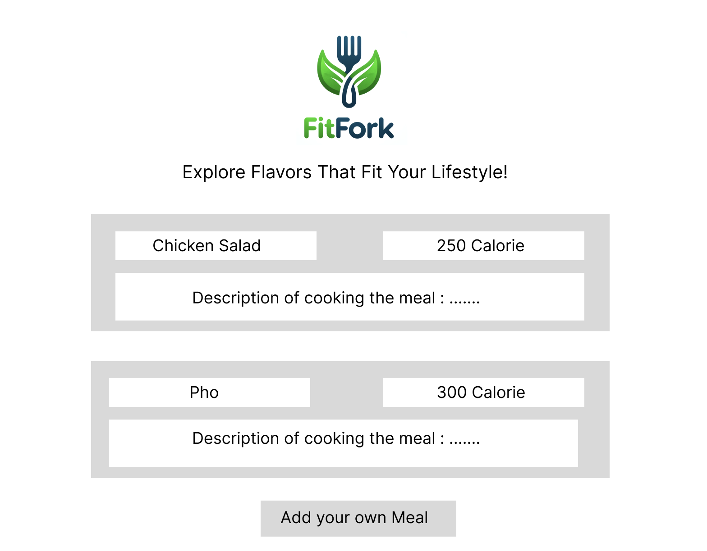
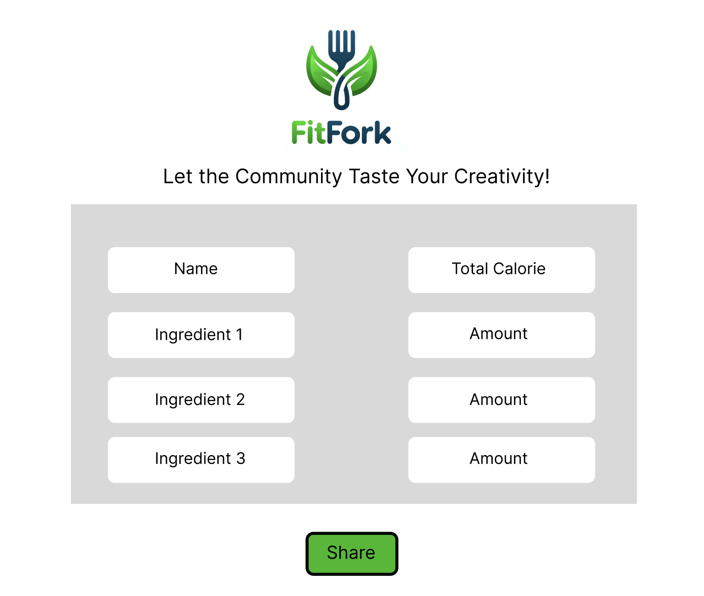
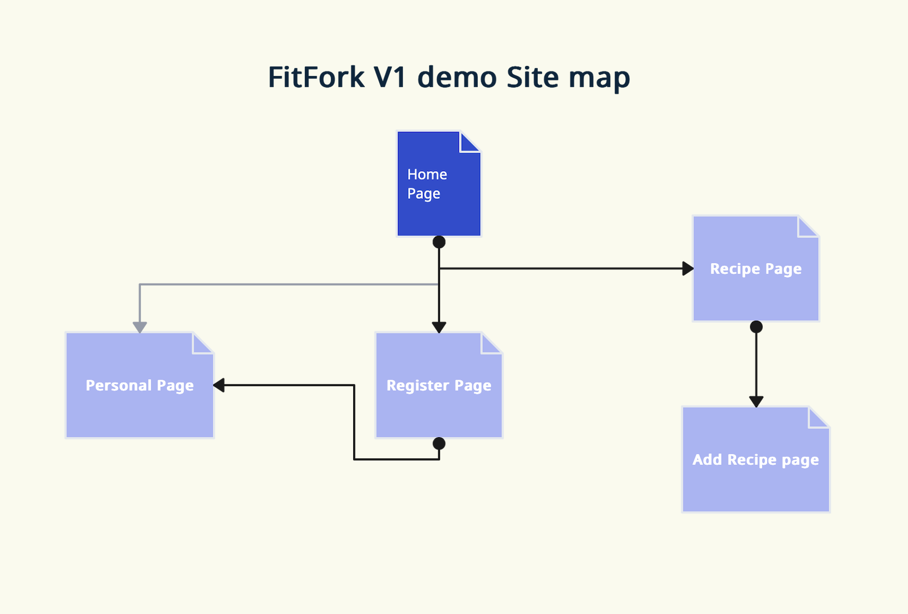

# FitFork

### Overview

FitFork is a revolutionary app designed to empower users to make smarter, healthier eating choices. By simply inputting food ingredients, FitFork analyzes potential dish combinations and provides tailored recommendations that align with health principles and dietary needs.

**Key Features:**

- **Ingredient Analysis**: Users can enter any set of ingredients, and FitFork will instantly suggest a variety of healthy dishes that can be made from those ingredients.
- **Dish Recommendations**: FitFork uses an algorithm to recommend dishes that not only taste good but are also beneficial for health, considering factors like nutritional balance and dietary restrictions.
- **Calorie Tracker**: With every dish recommendation, FitFork provides detailed nutritional information, including calorie counts, helping users manage their dietary goals effortlessly.

### Data Model

The application will store Users and Recipe

1. Users can store their food material as a list and also their desired calories for each dish
2. Recipe should  the food material it needs, and also the way to cook it, and the calories it provided

An Example user

```json
{
  "username": "imbillyannnn",
  "hash": "a_password_hash",  // Replace with the actual hash value
  "foodMaterials": [
    { "name": "lettuce", "quantity": 200 },
    { "name": "apple", "quantity": 100 }
  ],
  "desiredCal": 500
}
```

An Example Recipe

```json
{
  "dishName": "Grilled Chicken Salad",
  "ingredients": [
    { "name": "Chicken", "amount": 100 },
    { "name": "Cucumber", "amount": 200 }
    // Additional ingredients can be added here following the same pattern
  ],
  "totalCal": 300
}
```

### Link To Commented First Draft Schema

### Wireframes

`/` - login page



`/register` - Register Page -users can register their account in this page



`/username/home` --- the home page of user, exhibit the user's ingredients and also their desire calorie



`/recipe` --- check all the recipe and also asked the users to add their own recipe



`/recipe/add` --- add the new food recipe and publish it to the community



### Site map



###  User Story

1. As a non-register user :
    1. I can register a new account with the site
    2. I can check out the recipes in the database
    3. I can share my own recipe to the community and be stored in the recipe
2. As a user : 
    1. I can login in the site
    2. I can view the past ingredient I putted in
    3. I can view my desired Calories 
    4. I can put in my new food ingredient and used the past ingredients to generate the dishes that fit my needs(including covering the ingredient, and below or equal my desired engery input)

### Research Topics

- (3 points) Unit testing with JavaScript
    - [Jest](https://jestjs.io/)
    - [Jasmine](http://jasmine.github.io/)
    - [Mocha](https://github.com/mochajs/mocha)
    - Any others found through research
    - Minimally 4 tests
    - You'll have to link to testing code in repository
    - … and show a screen capture of tests
- (2 points) Use a CSS framework or UI toolkit, use a reasonable of customization of the framework (don't just use stock Bootstrap - minimally configure a theme):
    - [tailwind.css](https://tailwindcss.com/)
    - [Bootstrap](http://getbootstrap.com/)
    - [Semantic UI](https://semantic-ui.com/)

### [Link To My Project Repository](https://github.com/nyu-csci-ua-0467-001-002-spring-2024/final-project-yibo-yan)

### Annotations / Reference Used 

1. [Bootstrap](https://getbootstrap.com)
2. [Monzilla](https://www.mozilla.org/en-US/)
3. [MDN Doc](https://developer.mozilla.org/en-US/)


